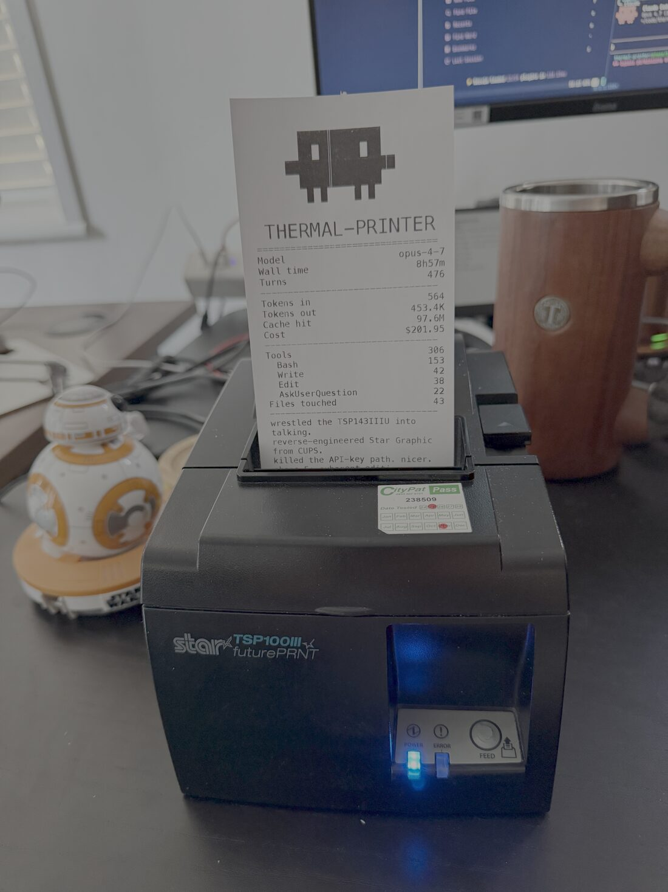

# thermal-printer

A Python CLI that drives a **Star TSP143IIIU** thermal printer over raw
USB, plus a `/receipt` Claude Code slash command that prints a physical
receipt of a coding session — tokens, time, files touched, lines added,
cost, and a 3–5 line narrative written by the session's own Claude.

<p align="center">
  
</p>

…and what it renders, in the abstract:

```
                            ┌──────────────┐
                            │   CLAUDE     │  (the actual logo)
                            │      session │
                            └──────┬───────┘
                                   │
                   Model   opus-4-7│
                   Wall time 1h 32m│
                   Turns       480 │
                   ────────────────│
                   Tokens in    568│
                   Tokens out 454K │
                   Cache hit   99M │
                   Cost      $45.54│
                   ────────────────│
                   Bash         154│
                   Write         42│
                   Edit          38│
                   Read          15│
                   Files          43│
                   Lines +1354 -381│
                   ────────────────│
                   five phases shipped.
                   reverse-engineered
                   star raster from cups.
                   the printer sings.
                                   │
                                   ▼ (cut)
```

## Install

macOS only. Requires Python 3.11+, [`uv`](https://docs.astral.sh/uv/),
and `libusb` from Homebrew.

```sh
brew install libusb
uv tool install .
```

If the Star is already paired in **System Settings → Printers**, remove
it first — macOS otherwise holds the device via CUPS and `pyusb` cannot
claim the interface.

## Daily use

From inside a Claude Code session, type `/receipt`. The slash command at
`.claude/commands/receipt.md` writes the narrative summary from its own
context and shells out to the CLI.

From a terminal, manually:

```sh
thermal-print print demo                                        # visual showcase
thermal-print print session --session-id $SID --cwd $PWD        # stats only
thermal-print print receipt --session-id $SID --cwd $PWD \
  --summary "your 3-5 line narrative."                          # stats + narrative
thermal-print print mandala                                     # procedural art
```

Inside a Claude Code session, `$CLAUDE_CODE_SESSION_ID` and `$PWD` are
both available with no setup.

## Templates

`thermal-print print <name>` dispatches to any module in
`src/thermal_print/templates/` exposing `NAME: str` and
`render(ctx, r: Receipt)`. Drop a file there, run the CLI — done.
Shipped: `hello`, `demo`, `session`, `receipt`, `playground`, `mandala`.

## Development

```sh
uv sync
uv run pytest -q
uv run thermal-print print hello
```

Tests cover the bitmap byte stream (snapshot + structural assertions),
template auto-discovery, the persistent serial counter, and the Claude
Code JSONL parser.

**Printer not printing?** The TSP143IIIU does **not** speak ESC/POS — it
ships in Star Graphic raster mode and silently drops character-stream
commands (bytes accepted, no paper, no error). The full discovery story,
the load-bearing `ESC * r R / ESC * r A` quirk, and the verified USB
constants live in
[`wiki/notes/2026-05-27-tsp143iiiu-default-mode.md`](wiki/notes/2026-05-27-tsp143iiiu-default-mode.md).
For `libusb backend not found` run `brew install libusb`; for permission
errors, remove the Star from System Settings → Printers and replug.

## The why — see the wiki

This repo keeps an Obsidian-style engineering wiki as the source of truth
for *why* it's built the way it is. Start at
[`wiki/index.md`](wiki/index.md):

- [`brief`](wiki/brief.md) — what it is, the feel it's going for, non-goals
- [`architecture`](wiki/architecture.md) — the device adapter / renderer / template seams
- [`decisions/`](wiki/decisions/) — ADRs 0001–0006 (shape, CLI, templates, layout grammar, stats schema, the LLM-via-subagent pivot)
- [`build-log`](wiki/build-log.md) — one entry per phase, including the hardware/raster pivot
- [`notes/`](wiki/notes/) — incident write-ups (the TSP143IIIU mode discovery)
- [`retro`](wiki/retro.md) · [`learnings`](wiki/learnings.md) · [`improvements`](wiki/improvements.md)

## License

MIT — see [LICENSE](LICENSE).
